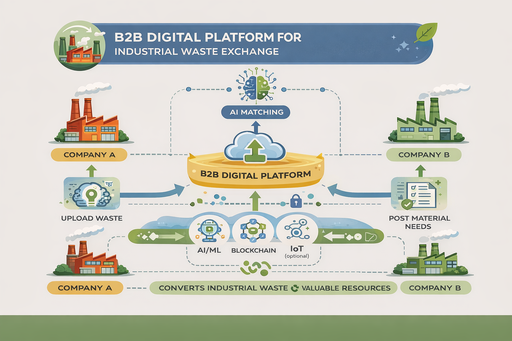

# 🌱 Sustainability Platform

## 🚀 Live Demo  
Coming soon...

## 💡 Overview  
An AI-powered B2B platform that connects industries to exchange waste as valuable resources and track environmental impact.
🚨 Problem

Industries generate large amounts of reusable waste, but:
No system to connect companies
Resources go to waste
💡 Solution

A B2B platform that:
Matches companies using AI
Enables waste exchange
Tracks environmental impact

⚙️ Features
🤖 AI-based matchmaking
🔗 Secure transactions
📊 Impact analytics
🌐 Scalable cloud system

🛠️ Tech Stack
Frontend: React / HTML-CSS
Backend: Node.js / Python
Database: Firebase / MongoDB
AI: Matching algorithm
Blockchain (optional)

🚀 Future Scope
IoT integration
Real-time tracking
Global expansion
